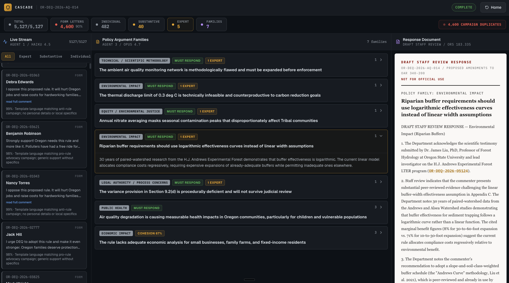

# Cascade - Public Comment Intelligence Engine

A multi-agent AI system that processes thousands of regulatory public comments into a legally defensible Response-to-Comments document.

**Won first place at the Oregon State Claude Code Hackathon (May 2026, Portland).**



## The Problem

When a government agency proposes a new rule, they must accept public comment and formally respond to every substantive argument. Oregon DEQ's last climate rule received 5,127 comments. Analysts spend 6-12 weeks reading through them manually. Miss one expert's legal challenge, and the rule gets overturned in court.

## Architecture

3-stage pipeline with model selection optimized for cost and capability:

| Stage | Model | Task | Cost | Why This Model |
|-------|-------|------|------|----------------|
| Classification | Haiku 4.5 | Triage all 5,127 comments, detect campaigns | ~$2 | Pattern-matching task, needs speed not reasoning |
| Extraction | Sonnet 4.6 | Decompose 427 substantive comments into structured arguments | ~$5 | Balances reasoning quality against throughput |
| Synthesis | Opus 4.7 | Cluster into policy families, draft formal responses | ~$3 | Deep reasoning justified for legal synthesis |

**Total pipeline cost: ~$10** to process a rulemaking that takes human analysts 6-12 weeks.

```
5,127 raw comments
       |
       v  Agent 1 (Haiku) -- 3 parallel batches of 25
       |
       +-- 4,600 form letters ---------- COLLAPSED (campaign detected)
       +-- 482 individual opinions ----- TRACKED (convergence rule applies)
       +-- 427 substantive + expert ---- PASSED TO AGENT 2
                    |
                    v  Agent 2 (Sonnet) -- 3 concurrent extractions
                    |
                    427 structured arguments
                    |
                    v  Agent 3 (Opus) -- 1 synthesis call
                    |
                    7 policy argument families
                    |
                    v  Human analyst clicks cluster
                    |
                    Draft Staff Response with citation traceability
```

## Key Engineering Decisions

- **SSE streaming**: UI renders results in real-time as each agent completes
- **Convergence detection**: 50+ independent individuals making the same argument triggers mandatory response (not just expert presence)
- **Campaign detection**: Identifies coordinated form letter campaigns and collapses duplicates
- **Bidirectional traceability**: Every comment ID in a response is clickable, every comment traces forward to its cluster
- **Human-in-the-loop**: Every output labeled DRAFT. Copilot, not autopilot.
- **Rate limiting**: Throttled concurrency to stay within API rate limits

## Tech Stack

- Next.js 16 (App Router)
- TypeScript
- Tailwind CSS v4
- Anthropic Claude API (Haiku 4.5, Sonnet 4.6, Opus 4.7)
- Server-Sent Events for streaming

## Running Locally

```bash
npm install

# Add your Anthropic API key
echo "ANTHROPIC_API_KEY=sk-ant-your-key" > .env.local
echo "ANTHROPIC_BASE_URL=https://api.anthropic.com" >> .env.local

# Build and run (production mode recommended)
npm run build
npm run start
```

Open http://localhost:3000. Click **Launch Demo** to see pre-computed results (no API key needed).

## Live Demo

https://cascade-ops.vercel.app

Click **Launch Demo** to explore the full dashboard with pre-computed results.

## License

MIT
